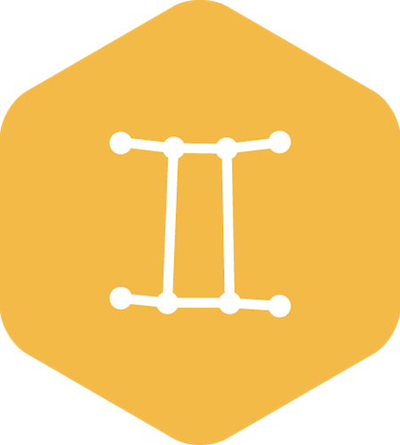

   

# Similar plugin for Craft CMS 3.x

Similar for Craft lets you find elements, Entries, Categories, Commerce Products, etc, that are similar, based on... other related elements.

Related: [Similar for Craft 2.x](https://github.com/aelvan/Similar-Craft)

## Requirements

This plugin requires Craft CMS 3.0.0-RC1 or later.

## Installation

To install the plugin, follow these instructions.

1. Open your terminal and go to your Craft project:

        cd /path/to/project

2. Then tell Composer to load the plugin:

        composer require nystudio107/craft-similar

3. In the Control Panel, go to Settings → Plugins and click the “Install” button for Similar.

You can also install Similar via the **Plugin Store** in the Craft AdminCP.

## Similar Overview

Similar is a Craft CMS 3 port of the [Similar for Craft 2.x](https://github.com/aelvan/Similar-Craft) plugin by André Elvan.

Below is the original README.md (with minor edits to reflect changes due to the port to Craft CMS 3):

# Usage
The plugin has one template method, `find`, which takes a parameters object with two required parameters, `element` and `context`. To find entries that are similar to `entry`, based on its tags in the Tagtag field `entry.tags`:

    
    <ul>
    
        <li>{{ similarEntry.title }} ({{ similarEntry.count }} tags in common)</li>
    
    </ul>
    
There is also a third, optional parameter that you probably would want to use most of the time, `criteria`. `criteria` lets you create the base ElementQuery that Similar will extend, giving you the ability to use all of Craft's usual goodies for your queries. If you'd want to limit the number of entries returned (good idea!), you could do it like this:

    
    
    
    <ul>
    
        <li>{{ similarEntry.title }} ({{ similarEntry.count }} tags in common)</li>
    
    </ul>

The supported element types are `Entry`, `Asset`, `Category`, `Tag`, `User` and `Commerce_Product`. If you miss one, send me a feature request.

The `context` parameter takes either an `ElementQuery`, or a list of ids. If you want to find similar entries based on an entry's tags and categories, you could do:

    
    
    

The returned model will be an extended version of the model of the element type you supplied. In the above examples where similar entries are returned, a `SimilarEntry` which extends `Entry` will be returned, giving you all the methods and properties of `Entry` in addition to `count` which indicates how many relations the entries had in common.

# Matrix gotcha
Similar will not take relations inside Matrix blocks into account. 

# Price, license and support
The plugin is released under the MIT license, meaning you can do what ever you want with it as long as you don't blame me. **It's free**, which means there is absolutely no support included, but you might get it anyway. Just post an issue here on github if you have one, and I'll see what I can do. :)

## Similar Roadmap

Some things to do, and ideas for potential features:

* Release it

Brought to you by [nystudio107.com](https://nystudio107.com/)
